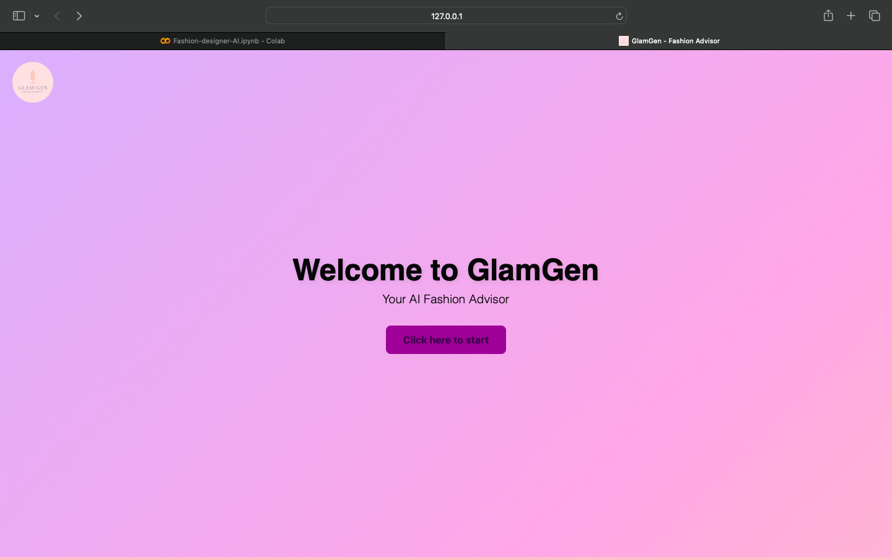
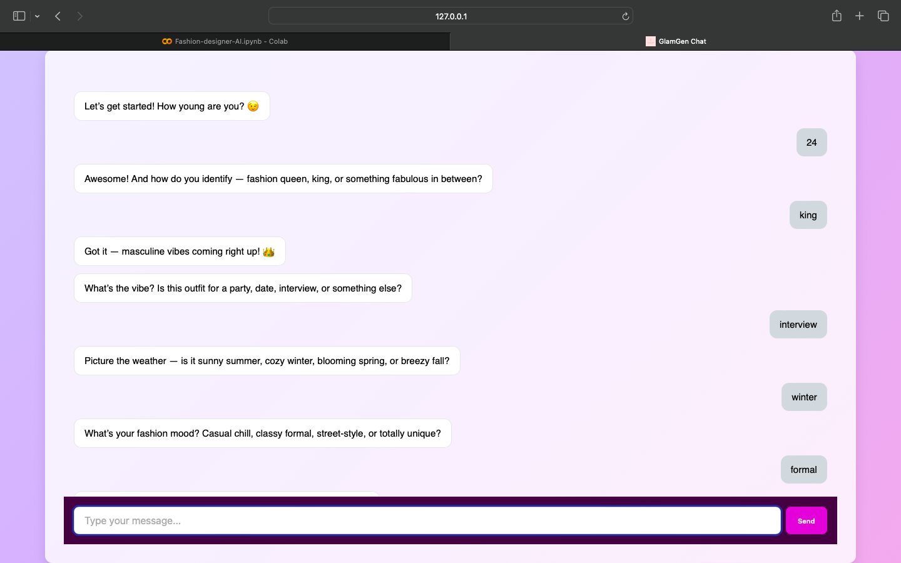
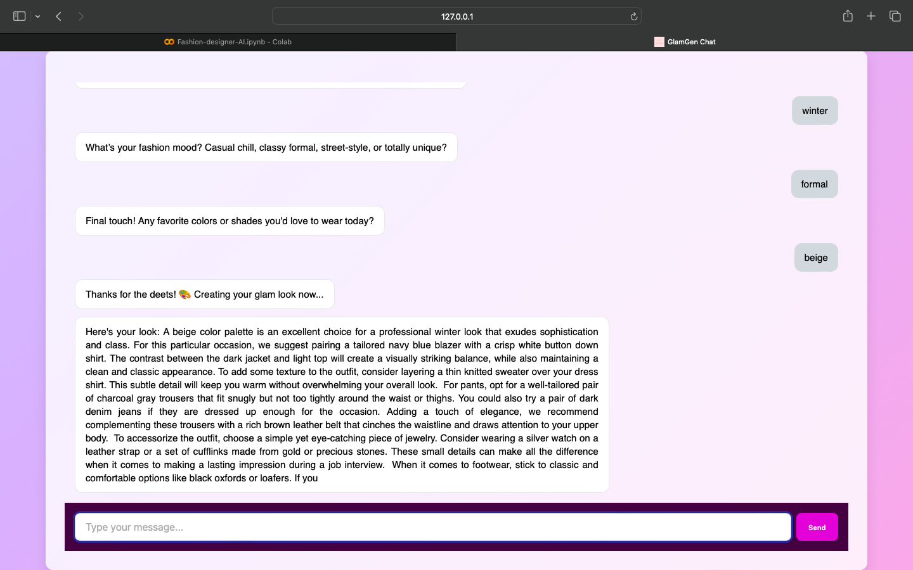
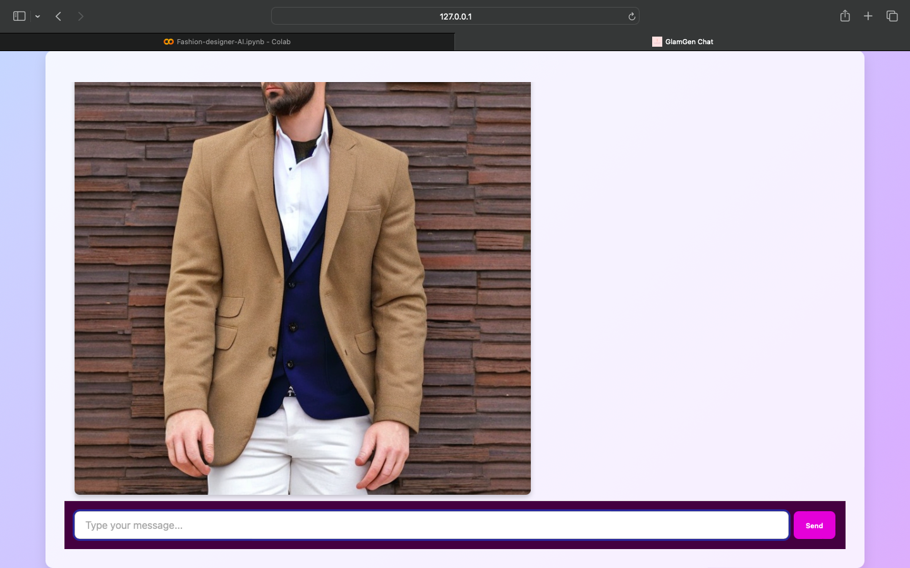

# GlamGen – AI-Powered Fashion Designer

> GlamGen is your personal AI fashion stylist. 🧠🎨  
> It chats with users to understand their preferences — age, gender, occasion, season, style, and colors — and uses LLMs and Stable       Diffusion to generate a custom outfit description and image tailored just for them.
> Think of it as a GenAI stylist that turns your vibe into visuals.


## 🚀 Demo

#### 🎞️ Instant Preview  
Here's a quick look at GlamGen in action — from chatting with the user to generating a unique outfit and image:


#### 📺 Full Walkthrough  
Watch the full experience (from landing page to outfit reveal) here:  
[▶️ Watch on YouTube](https://www.youtube.com/watch?v=YOUR_VIDEO_ID)


## ✨ Features

- 💬 **Conversational AI Interface** to collect detailed user preferences (age, gender, occasion, season, style, colors)
- 🤖 **Outfit descriptions generated using** [Mistral-7B Instruct](https://huggingface.co/mistralai/Mistral-7B-Instruct-v0.1) — a        powerful LLM for stylistic prompts
- 🎨 **Fashion visuals created with** [Stable Diffusion 2.0](https://huggingface.co/stabilityai/stable-diffusion-2) based on dynamic     user input
- 🔁 **End-to-end pipeline** from frontend → FastAPI backend → Google Colab (LLM + Diffusion) → frontend response
- ⚡ **Optimized architecture** using Colab + Ngrok, reducing image generation time from ~30 minutes (CPU) to under a minute (GPU)
- 🌐 **CORS-enabled FastAPI backend** ensures smooth and secure communication between all layers
- 🧵 **Lightweight frontend built with HTML, CSS, and JavaScript** for fast, responsive interactions


## 🛠️ Tech Stack

**Frontend**: HTML, CSS, JavaScript
**Backend**: Python, FastAPI, httpx
**AI Models**: Mistral-7B Instruct (LLM) for outfit descriptions
**Image Generation**: Stable Diffusion 2.0 (Diffusers library)
**Deployment**: Google Colab, Ngrok


## 🧠 System Architecture

- User opens the web app and accesses the Chat UI
- The user's prompt is sent to the FastAPI backend
- Backend sends the prompt to Mistral-7B Instruct (LLM) to generate a detailed outfit description
- The generated description is passed to Stable Diffusion 2.0 (via Hugging Face Diffusers) to generate an outfit image
- Both:
  > • The outfit description (from Mistral)  
  > • The outfit image (from Stable Diffusion)  
  are returned to the frontend
- The frontend displays the AI-generated outfit and its detailed style breakdown

#### 📊 System Flow Diagram

User
 ↓
Chat UI (Frontend)
 ↓
FastAPI Backend
 ↓
Mistral-7B (Outfit Description Generator)
 ↓
Stable Diffusion 2.0 (Image Generator)
 ↓
Outfit Description + Image 
 ↓
Chat UI (Display Result)


## 🧰 Setup Instructions


#### 📦 1. Clone the Repo

  ```bash
  git clone https://github.com/DhanyaAR/GlamGen.git
  cd GlamGen
  ```


#### 🧪 2. Configure Google Colab

- Open the [GlamGen Colab notebook](./Fashion_designer_AI.ipynb) included in this repo
- Replace the placeholder values with **your own Hugging Face and ngrok tokens**

  - You can get the tokens here:

    • [Hugging Face token](https://huggingface.co/settings/tokens)
    • [ngrok token](https://dashboard.ngrok.com/get-started/your-authtoken)
      
- Run all cells
- Copy the public `ngrok` URL (e.g. `https://abc123.ngrok-free.app`)


#### ⚙️ 3. Start FastAPI Backend

• Install dependencies:

  ```bash
  pip install fastapi uvicorn httpx python-multipart pydantic
  ```

• Export the Colab URL:
  Replace the URL below with the one you copied from Colab (ngrok)

  ```bash
  COLAB_API_URL = os.getenv("COLAB_API_URL", "https://abc123.ngrok-free.app")
  ```

• Run the FastAPI server:

  ```bash
  uvicorn main:app --reload
  ```


#### 💬 4. Launch Frontend

- Open `landing.html` in any browser
- You’ll see the landing page → chat interface
- Interact with the bot and receive:
  • **Style description** (from Mistral)
  • **Outfit image** (from Stable Diffusion)


## 🧪 Sample Output with Screenshots

#### 🔹 Landing Page
The initial screen of GlamGen displays a welcome message along with a button.
Clicking the button takes the user to the main chat interface where they can interact with the fashion assistant.



#### 🔹 Chatbot Page
The chatbot interface interacts with users by asking a series of questions about their:
- Age
- Gender
- Occasion
- Season
- Style
- Favorite colors
Users answer these questions step-by-step. Their responses are collected and sent to the backend to generate a personalized outfit suggestion.



#### 🔹 Text Response
The chatbot (powered by Mistral) generates a fashion description based on the input.



#### 🔹 Image Response
The described outfit or style is visualized using Stable Diffusion and returned as an AI-generated image.




## 🚀 Future Improvements

- **User history & personalized recommendations**: Save past interactions to better understand individual style preferences and suggest more tailored outfits over time.
- **E-commerce integration**: Link recommended outfits to online stores for easy purchasing.
- **Authentication & profiles**: Enable user accounts to securely save preferences and outfit history.
- **Voice input support**: Allow users to interact hands-free using speech-to-text.
- **Image saving & sharing**: Let users save generated outfit images or share them on social media.
- **Virtual try-on**: Upload user photos to visualize how outfits would look on them.
- **Enhanced UI/UX**: Add animations, richer styling, and mobile-friendly responsiveness.
- **Model improvements**: Experiment with prompt tuning or newer LLMs and diffusion models for better results.


## 🤝 Contributors

- **Dhanya A R**— Lead developer; designed and implemented the backend, AI pipeline, and frontend-backend integration.
- **Anushree Shetty** — Created the frontend layout and styling using HTML/CSS.
- **C Disha** — Explored an initial GPT-2 based image generation approach (not used in final version).


## 👩‍💻 Project Lead

While this was a collaborative effort, **Dhanya A R** led the core technical development of the project, including:

- Architecting the backend using FastAPI
- Building the AI image generation pipeline via Google Colab + ngrok
- Optimizing generation time from 30+ minutes to under 1 minute
- Implementing JavaScript-based user input handling and backend integration
  
Note: The frontend layout was developed by Anushree Shetty. An early GPT-2 based image generation code was contributed by C Disha but not used in the final implementation.


